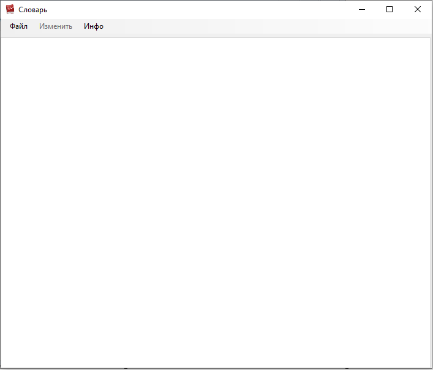
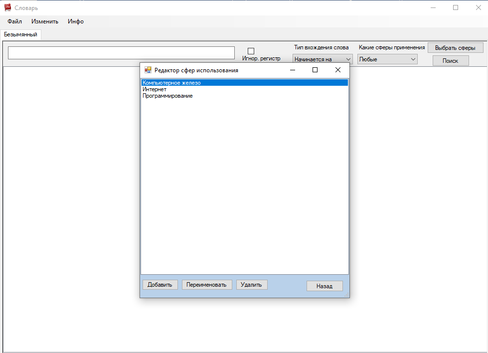

**Эта программа представляет собой словарь, реализованный в среде**  **PascalABC**  **для курсового проекта. Описание программы и примеры использования см. ниже.**

**Сейчас есть след. минусы**** :**

**1)Отсутствие поддержки**  **UTF**** -8 для хранения словаря.**

**2)Не оптимизированные алгоритмы для поиска по словарю и добавления в словарь, что в теории может привести к тормозам, но они пока не обнаружены.**

_ **Основная идея программы.** _

Программа поддерживает создание словаря , загрузку из файла уже существующего, редактирование словаря, поиск по словарю.

В словаре могут быть определены области(сферы) применения слов(к прим. машиностроение , медицина и тд.),слова могут относится к этим сферам.

Каждому слову сопоставлена его карточка, на которая содержатся его сферы применения, толкование, синонимы, примеры использования. Карточку слова можно редактировать т,е изменить: принадлежность к тем или иным сферам ,толкование ,список синонимов, примеры использования. Также слово можно удалить из словаря или добавить в него.

Список сфер применения можно редактировать т.е добавить новую сферу применения, переименовать/удалить , при этом это изменение затронет все слова у которых она была.

Поиск для пользователя выглядит так : он вводит слово в поисковую строку, выбирает параметры поиска и получает подходящий список слов из словаря, нажимает на нужное и переходит на его карточку.

Поиск поддерживает такие опции: игнорирование регистра при поиске, принадлежность слов к сферам применения(например слова относящиеся только к машиностроению),можно будет получить все слова по тем или иным сферам, или вообще все слова из словаря – это может быть очень удобным при создании/редактировании словаря.

Также программа поддерживает работу с несколькими словарями при помощи вкладок. Вкладки создаются при создании/загрузки словаря, их также можно закрывать, при этом , если изменения внесённые в словарь не сохранены будет выходить предупреждение.

_ **Описание формата хранения словаря на диске.** _

Словарь хранится в виде тестового файла, использование типизированного файла ограничило бы размер строк , или ,при выборе большого размера строк в типиз. файле, словарь занимал бы дисковое пространство не оптимально - одни слова имеют большое толкование, а другие маленькое(здесь я имею ввиду строку, в которую записано толкование слова).

Хранения слова в текстовом файле подразумевает использование разделителей, но если выбрать разделителями печатные символы то при сохранении их придётся заменять/экранировать ,а при выводе заменять разэкранировать. Был выбран такой подход : в качестве разделителей приняты нечитаемые ASCII символы и символы перехода на новую строку. Ввод таких символов пользователю(кроме переноса) запрещён, а символы переноса заменяются на другой нечитаемый ASCII символ при сохранении в словарь.

Структура файла выглядит так:

Здесь символы | ,=(заменяет перенос строки),+ условно обозначают нечитаемые ASCII символы

Имя словаря | сфера применения 1 + сфера применения2

Слово1| Толко=вание | Примеры испо=льзования | сф. прим1+сф. прим2|синонимы

……

СловоN | Толко=вание | Примеры исполь=зования | сф. прим1+сф. прим2|синонимы

В первой строки узказаны все сферы применения которые есть в словаре. При отсутствии какого либо элемента(допустим толкования),место остаётся пустым , наприм. :

Слово1| | Примеры испо=льзования | сф. прим1+сф. прим2|синонимы

 **Программа разбита на 9 файлов:** 

1. Модуль основного окна(меню) MainForm (main)
2. Модуль techdictmodule.pas содержащий описание класса словарь, и функции связанные с ним .
3. Модуль содержащий окно для работы со списком областей употребления слов SphEditor.pas
4. Модуль MainWindowPanels.pas содержащий описание классов панелей и вкладки(ShowPanel,FindPanel,CustomTab)
5. Модуль GetText.pas содержит описание класса модального окна для получения строки от пользователя.
6. Модуль Help.pas содержит описание класса окна cправки.
7. Модуль GetSphListModule.pas содержит описание класса окна для выбора нужных сфер использования для поиска по словарю.
8. Модуль EditAddWordForm.pas содержит описание окна для добавления /редактирования слова.
9. Start.pas Отвечает за запуск приветственного окна и окна программы

# Пример использования программы.

Основное окно программмы.

Рисунок 1 – Основное меню программы

Для того ,чтобы открыть словарь нажмите файл=\>загрузить=\>выберите нужный файл=\>нажмите ОК, или файл=\>Создать ,чтобы создать новый словарь. В результате вы увидите это:

Рисунок 2 – Основное меню программы с подключенным словарём

Панель вкладок позволяет работать сразу с несколькими словарями, для того чтобы закрыть вкладку кликните по ней два раза ПКМ.

Для того,чтобы добавить слово в словарь нажмите изменить=\>добавить слово введите слово, толкование ,его области применения и нажмите добавить.

Рисунок 3 – Добавление слова

Для работы со сферами применения слов нажмите Изменить=\>Области применения.

Рисунок 4 – Редактор сфер использования

При помощи Изменить=\>Переименовать словарь можно изменить имя словаря.

Рисунок 5 – Изменение имени словаря

При помощи пунктов Файл/«Сохранить»,»Сохранить как» можно сохранять файл. Отличие этих пунктов состоит в том ,что при Загрузке словаря/Нажатии кнопки «Сохранить» и выбора пути сохранения для созданного словаря,вкладка ассоциируется с этим путём, и сохранение по кнопке «Сохранить» будет идти по этому пути.Для кнопки «Сохранить как» никакой ассоциации не происходит, каждый раз нужно выбирать новый путь.

Поиск осуществляется при помощи панели поиска, **Если само слово не играет роли** ,например нужны все слова относящиеся к сфере кулинарии нужно **оставить строку поиска пустой**.

Рисунок 6 – Панель поиска.

Внимание!!!

В качестве имен слов,сфер применения не допустимы пустые строки(в т.ч состоящие из пробелов).Нечитаемые ASCII символы недопустимы также : если они будут в имени сферы или слова, то программа не позволит вам добавить такое слово/сферу в словарь, а из толкования слова,синонимов и проч. остального такие символы будут удалены без предупреждения.
